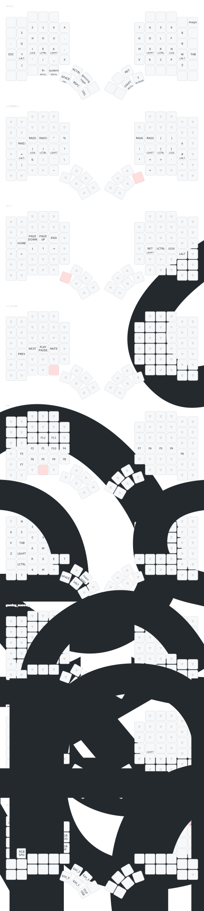

# Glove80 Layout
This is [frozolotl](https://github.com/frozolotl)'s layout for the [Glove80](https://www.moergo.com/) keyboard.

## Goals
- Good for German and especially English.
- Easily accessible symbols optimized for programming.
- Games should be playable without much configuration.
- Home-row mods without much finagling.
- Long-term efficiency is prioritized over being easy to learn.

## Requirements
Use the following keyboard configuration:
- Layout: `us`
- Variant: `de_se_fi`
- Options: `eurosign:e,compose:rctrl`

## Credits and Inspirations
- Main Layer: [BEAKL T-t 04](http://ieants.cc/beakl/#beakl-t-t-04) by Xay Voong and (I presume) Ian Douglas.
- Home row mods: [urob's zmk-config](https://github.com/urob/zmk-config) by Robert U.
- Symbol Layer: [Designing a Symbol Layer](https://getreuer.info/posts/keyboards/symbol-layer/index.html) by Pascal Getreuer.
- Gaming Layer: [Glorious Engrammar](https://sunaku.github.io/moergo-glove80-keyboard.html#spacegrams) by Suraj N. "sunaku" Kurapati.
- My older layouts for the [Ergodox EZ](https://configure.zsa.io/ergodox-ez/layouts/rPp0Q/latest/0) and the [ZSA Moonlander](https://configure.zsa.io/moonlander/layouts/yBdDx/latest/0).

## Visualization

